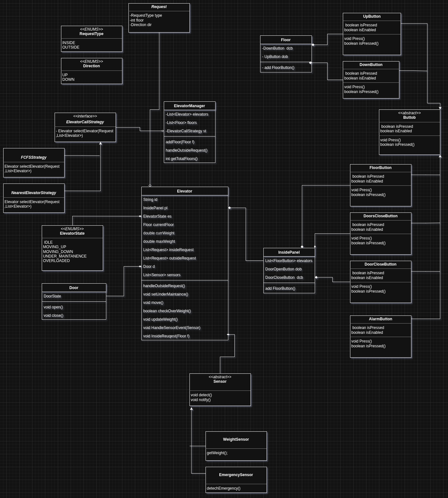

# Low-Level Design (LLD): Elevator System

## 1. Requirements
For a detailed list of functional and non-functional requirements, please see:
 **[Requirements.md](Requirements.md)**

## 2. Class Relationships & UML

The system follows a highly decoupled architecture where the `ElevatorManager` acts as the orchestrator and the `Elevator` acts as the state machine.



## 3. Design Patterns & Implementation

| Pattern | Purpose | Implementation |
| :--- | :--- | :--- |
| **Strategy Pattern** | **Smart Dispatching** | Used in ElevatorManager to select the best elevator based on distance and direction. See `ElevatorCallStrategy. |
| **Observer Pattern** | **Status Synchronization** | Used to notify all FloorPanel and InsidePanel displays of elevator state changes (floor, direction). See ElevatorObserver. |

## 4. Component Breakdown

| Component | Responsibility | Implementation Details |
| :--- | :--- | :--- |
| **ElevatorManager** | Orchestration | Receives floor calls; uses `Strategy` to dispatch. |
| **Elevator** | Core Logic | Manages request queues, direction, and movement. |
| **Floor & Panel** | User Interface | Captures user intent; implements `Observer` for display. |
| **Sensors** | Safety | `WeightSensor` for overload; `EmergencySensor` for alarms. |
| **Door & Display** | Hardware Emulation | Encapsulates specific hardware behavior (Opening/Closing). |

## 5. Code Structure

```text
code/elevator/
├── enums/       # System states and directions
├── model/       # Core domain entities (Elevator, Manager, Floor)
├── strategy/    # Dispatching algorithms (FCFS, NearestElevator)
├── panel/       # UI components (FloorPanel, InsidePanel)
├── sensors/     # Safety hardware (Weight, Emergency)
└── buttons/     # Input hardware
```

## 5. Execution
```
 javac elevator/*.java elevator/**/*.java
 java elevator.Main`

```