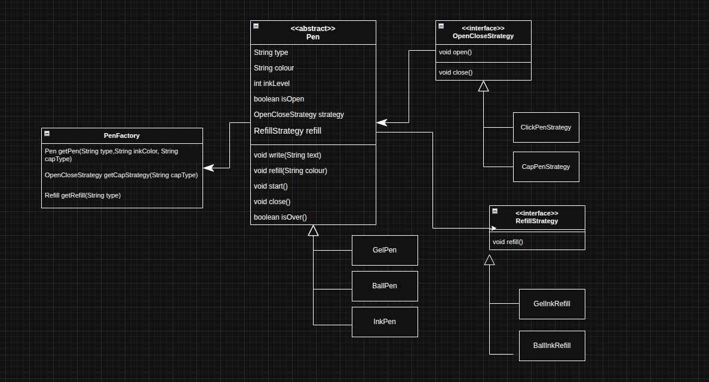

# Design a Pen

## Requirements
We need to build a Pen that can start, write, close, and be refilled.

## How It Works Behind the Scenes

Here is a quick breakdown of how the code is organized. The main goal was to keep things flexible and easy to update using some standard design patterns.

### 1. The Strategy Pattern (How it opens and closes)
Pens open in different ways—some click, some have caps, some twist. Instead of creating a messy family tree of classes (like `ClickGelPen` or `CapGelPen`), we pulled the opening/closing behavior out into its own thing called `OpenCloseStrategy`. The pen itself doesn't need to know *how* it opens; it just clicks or un-caps based on the strategy it was given.

### 2. Composition (Handling the ink)
A pen isn't the ink itself; it *holds* the ink. By giving the pen a `Refill` object (like a `GelRefill` or `BallPointRefill`), we separate the physical pen from the ink supply. This makes it super easy to swap out ink types or check if it's empty without having to rewrite any of the core pen logic.

### 3. The Factory Pattern (Building the pen)
Putting together a pen with the exact right refill and opening mechanism can get complicated. To keep the rest of our code clean, we use a `PenFactory`. You just tell the factory what you want (like a blue gel pen with a clicker), and it wires all the pieces together and hands you the finished product.

### 4. Abstraction (The blueprint)
The `Pen` base class acts as the master blueprint. It keeps track of the basics, like whether the pen is open and what color the ink is. It also enforces the rules: you can't write if the pen is closed, and you definitely can't write if it's out of ink. Specific pens (like a `GelPen`) just build on top of this reliable foundation.

### Putting It All Together
1. You ask the `PenFactory` for a pen, telling it exactly what features you want.
2. The factory gathers the right `Refill` and `OpenCloseStrategy`.
3. It builds the pen (like a `GelPen`), snaps all the parts inside, and hands it back to you.
4. You just use the pen normally (`start()`, `write()`, `close()`), and the individual parts handle the heavy lifting behind the scenes.